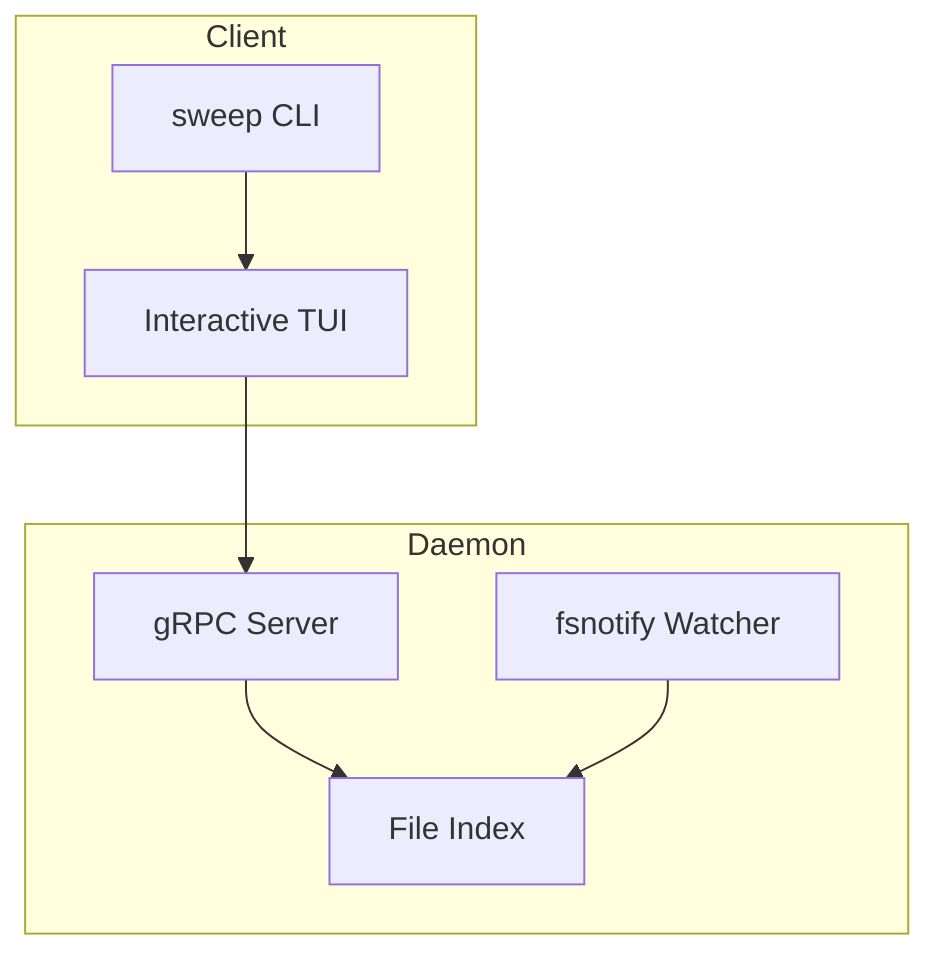

# Sweep

A disk space analyzer that finds large files consuming storage. Sweep provides both an interactive terminal user interface (TUI) and non-interactive output formats for scripting.

## Features

- **Interactive TUI** with two view modes:
  - **List view**: Flat list of files sorted by size
  - **Tree view**: Hierarchical directory navigation
- **Real-time updates** via daemon file watching
- **Non-interactive mode** with multiple output formats (JSON, CSV, YAML, Markdown, etc.)
- **Flexible filtering** by age, type, extension, and path patterns
- **Safe deletion** via system trash (not permanent)

## Installation

```bash
go install github.com/jamesainslie/sweep/cmd/sweep@latest
```

## Quick Start

```bash
# Scan current directory (launches TUI)
sweep

# Scan specific directory
sweep ~/Downloads

# Find files larger than 500MB
sweep -s 500M .

# Non-interactive JSON output
sweep -n -o json .

# Find video files older than 30 days
sweep --type video --older-than 30d .
```

## TUI Overview

The TUI displays large files with consistent headers across both view modes:

```
 [icon] SWEEP  47 files  1.2 GB  [checkmark] Freed 234 MB  [bullet] LIVE
  Scanned: 1,234 dirs, 5,678 files  |  Time: 2.3s
------------------------------------------------------------
  [Space] Toggle  [a] All  [n] None  [Enter] Delete  [q] Quit
------------------------------------------------------------
       Size  File
------------------------------------------------------------
 [checkbox]   1.2 GB  ubuntu-24.04.iso
 [checkbox] 856.3 MB  node_modules.zip
```

### View Modes

Press `t` to toggle between list and tree views.

**List View** (default):
- Flat list sorted by size
- Checkbox selection
- File path details on highlight

**Tree View**:
- Hierarchical directory structure
- Directories show aggregate large file size and count
- Percentage indicator shows relative size contribution
- Expand/collapse directories with Enter

### Keyboard Shortcuts

| Key | Action |
|-----|--------|
| `j/k` or arrows | Navigate |
| `Space` | Toggle selection |
| `Enter` | Expand/collapse (tree) or delete (list) |
| `t` | Switch view mode |
| `a` | Select all |
| `n` | Deselect all |
| `d` | Delete selected (tree) |
| `q` | Quit |

## Configuration

Configuration file: `~/.config/sweep/config.yaml`

```yaml
min_size: 100M
exclude:
  - .git
  - node_modules
  - .cache
```

## Documentation

- [User Guide](USER_GUIDE.md) - Detailed usage instructions
- [Changelog](CHANGELOG.md) - Version history

## Architecture



The daemon maintains a persistent index of large files and watches for filesystem changes. The TUI connects via gRPC to receive real-time updates when files are added, modified, or deleted.

## License

MIT
